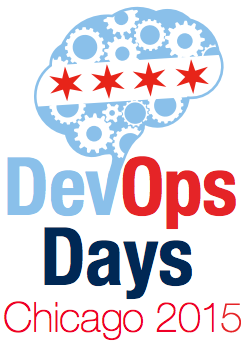
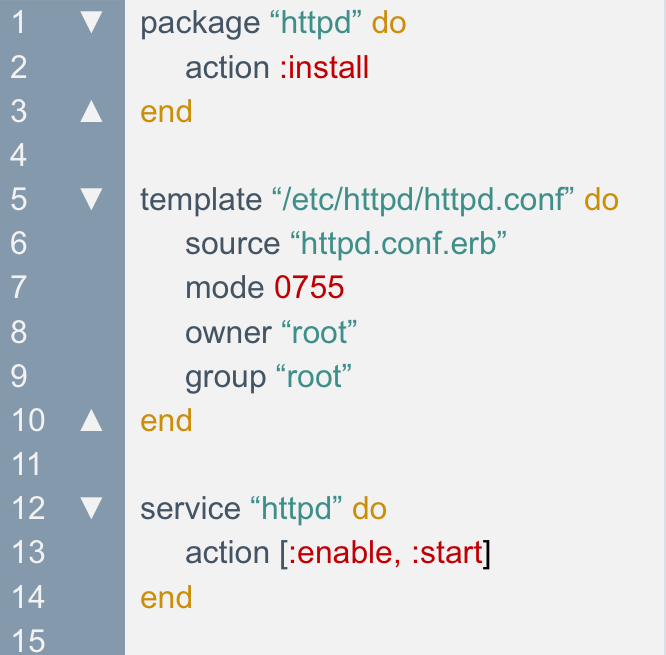
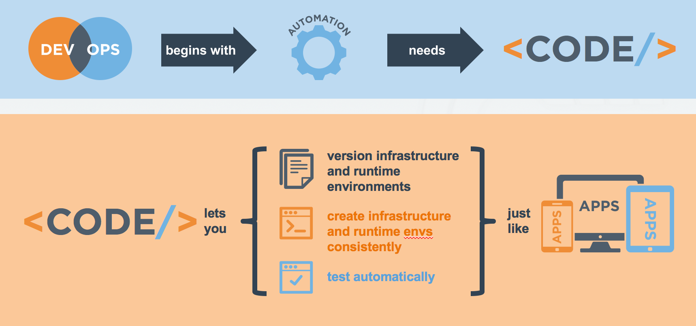
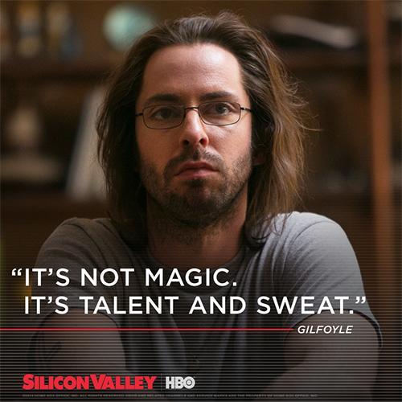

## Making Infrastructure S'mores With Chef

---

# whoami




---


# What is Chef?

- Define reusable resources and infrastructure state as code
- Manages deployment and
on-going automation
- Community content available
for all common automation tasks

^ Basically, with Chef you talk about WHAT you want and not HOW to do it. Full feature parity with Windows and Linux. With Chef we focus on the outcomes, not how the sausage gets made.

---



---
# Infrastructure as code

> Enable the reconstruction of the business from nothing but a source code repository, an application data backup, and [compute] resources
-- Jesse Robins

---
## Versioned

## Modularized

## Tested

---

# Executable Documentation

---

# Domain experts

- Systems are complicated today
- Nobody can know everything about the stack
- Let your domain experts contribute their portion directly

^ If you have a group that just writes the configuration code as requested by someone else, all you've done is move silos around.

---



## Beware of Hubris

^ Often times, we lock down systems to "protect" them. I will assure you that the very same sysadmins who insist that only they, by virtue of nothing more than job title, should be trusted to touch systems, will happily tell me "war stories" over a pint about times when the totally effed up everything.

---


## Anyone can do anything?

^ Don't worry. It's going to be okay. We've got the magic DevOps pixie dust.

---


# Old Way

## Communicate via tickets

^ This sucks because we are explaining things in English, and there can be confusion.

---


# New Way
## Communicate via code

^ What is a version control system but basically a communication tool?

---
# People make mistakes

## This doesn't scale

^ You aren't going to fix the humans, so fix the system

---


## How do I make sure nobody messes stuff up?

^ I thought DevOps was about trust? Can't we just have people do whatever they want?

---

#[fit]Testing is essential

^ It's not about trusting that someone won't do something malicious. Again, people make mistakes. Sidney Dekker’s Field Guide to Understanding Human Error is probably the most important book for people like us, meaning people that are in the IT world – it’s very accessible and gives lots of examples from fields outside of IT, but they’ve very relevant to what we do.

---

#Communicate through code (redux)

^ If you have people who care about things, they should be part of the code review process.

---
##What happens when you have one group writing all the automation?

---


^ If the infrastructure team does it all, the s'mores might just be a bunch of graham crackers, because that is all they know.

---


^ If the teams don't collaborate, then nothing merges together

---


^ And if you have a group that doesn't understand your systems at all, you get a banana instead of a s'more.

---
#[fit]How do we solve this?

---

## Encourage local testing with Foodcritic

^ Flag problems that might cause your Chef cookbooks to fail on converge

^ For example, FC010: Invalid search syntax

^ Identify style/convention that has been adopted by the Chef community

^ For example, FC004: Use a service resource to start and stop services

^ Run against static code, so tests are very fast (<5 seconds to run)

---
# Example Foodcritic custom rule
```ruby

rule 'COMP001', 'Do not allow recipes to mount disk volumes' do
  tags %w{recipe compliance}
  recipe do |ast|
    mountres = find_resources(ast, :type => 'mount').find_all do |cmd|
      cmd
    end
    execres  = find_resources(ast, :type => 'execute').find_all do |cmd|
      cmd_str = (resource_attribute(cmd, 'command') || resource_name(cmd)).to_s
      cmd_str.include?('mount')
    end
    mountres.concat(execres).map{|cmd| match(cmd)}
  end
end
```

---
# Error output from foodcritic
```bash
$ foodcritic –I /afs/getchef.com/foodcritic-rules/rules.rb .
COMP001: Do not allow recipes to mount disk volumes: ./recipes/default.rb:20
COMP001: Do not allow recipes to mount disk volumes: ./recipes/default.rb:26
```

---
#[fit]Use a pipeline

^ Infrastructure doesn't live in a vacuum. Things depend on each other.

---

#[fit]Chef audit mode as the final test

^ Audit mode is something we likely will be running on our production machines anyway. In a way, audit mode is considered "acceptance testing" for the machine as a whole...so why not use that in our test pipeline?

^ We want to test our infracode against our standards BEFORE it is deployed...we don't want to find out about this 6 months later during a pen test.

---

### Security and Compliance should be first-class citizens

^ "Security and compliance are just another aspect of quality" - Julian Dunn

^ We don't want to tack this on at the end - it should be part of our process throughout.


---
## Trust, But verify

^ Take a page from the folks at Etsy. They have a high-trust culture, but that doesn't mean you don't test. I don't even trust myself to remember to test all the time.

---

## Separation of concerns is a thing

---

##aka
###"my tests are failing, so I'll remove them"

^ The person in charge of the compliance code should not be the same as the person writing the infracode. That's how development works, right?

---


## Demo Time!

---
## To Review
- Trust (but verify) your domain experts
- Share the cooking
- Leverage Foodcritic
- Use your production audit cookbooks in your pipeline
- Did I mention test?

---

# Questions?
---
##resources
- Sidney Dekker - *Field Guide to Human Error*
- foodcritic.io
- learn.chef.io
- http://jtimberman.housepub.org/blog/2015/04/03/chef-audit-mode-introduction/

---
##moar resources
- twitter.com/mattstratton
- speakerdeck.com/mattstratton
- github.com/mattstratton/infrastruture-smores
- github.com/mattstratton/speaking
- arresteddevops.com
